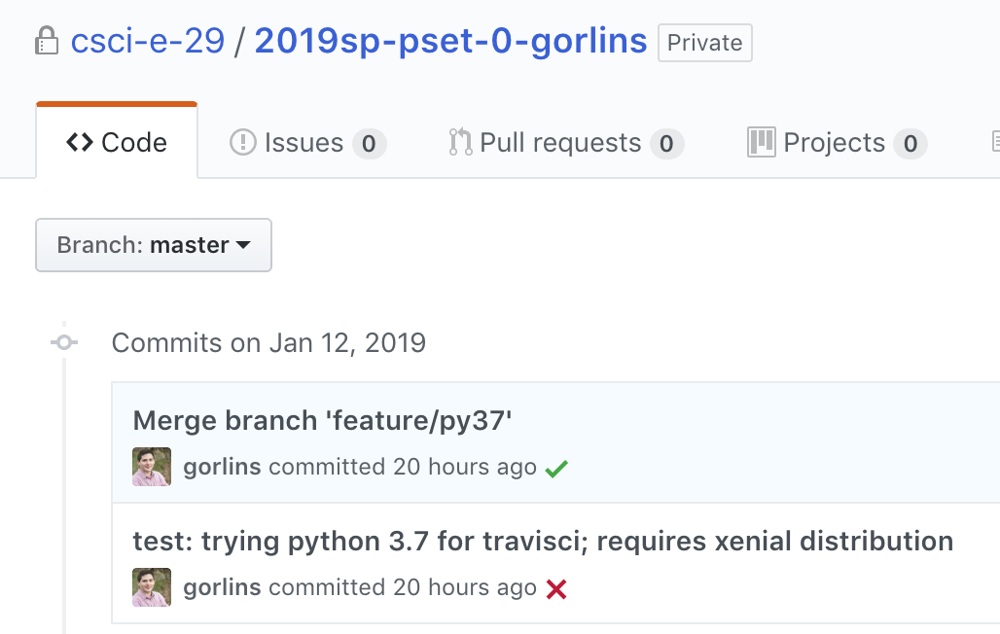

# Pset 0

This problem set is designed to be solvable with minimal prep work - you should
be able to complete it with your own prior knowledge and limited external
research beyond the provided tutorials. If it proves too challenging, please
discuss with the teaching staff whether you should consider delaying enrollment
in this course.

**Please complete this Pset before class begins** if possible.  Feedback will be
returned before the drop date.

<!-- START doctoc generated TOC please keep comment here to allow auto update -->
<!-- DON'T EDIT THIS SECTION, INSTEAD RE-RUN doctoc TO UPDATE -->
**Table of Contents**  *generated with [DocToc](https://github.com/thlorenz/doctoc)*

- [Setting up your environment](#setting-up-your-environment)
  - [Docker](#docker)
    - [Installation and setup](#installation-and-setup)
- [Grading standards and mechanics](#grading-standards-and-mechanics)
  - [Submissions](#submissions)
- [Showing your work!](#showing-your-work)
  - [CI/CD](#cicd)
  - [Git mechanics](#git-mechanics)
- [Problems (25 points)](#problems-25-points)
  - [Build badge (5 points)](#build-badge-5-points)
  - [Pyramid (5 points)](#pyramid-5-points)
  - [Fibonacci (15 points)](#fibonacci-15-points)
    - [A better solution (5 points)](#a-better-solution-5-points)
    - [Generalizing (10 points)](#generalizing-10-points)
- [Other grading aspects (40 points)](#other-grading-aspects-40-points)
  - [Testing Qualtiy (20 points)](#testing-qualtiy-20-points)
  - [Python Quality (10 points)](#python-quality-10-points)
  - [Git History (10 points)](#git-history-10-points)

<!-- END doctoc generated TOC please keep comment here to allow auto update -->

## Setting up your environment

You need a computer which can run python 3.7, and preferably an IDE and debugger.
A good example is
[PyCharm, which is free for students](https://www.jetbrains.com/student/).

### Docker
This course will explore Docker, a containerization system, to help develop
within fully repeatable environments.  You may need to use docker immediately
if you are developing on Windows (the unittests use [signals](https://docs.python.org/3.7/library/signal.html#signal.signal)).  You
should experiment with docker regardless, though it is not critical yet.

#### Installation and setup
You can install [Docker](https://docs.docker.com/install/) and
[Docker Compose](https://docs.docker.com/compose/install/) to get a fully
repeatable environment.  You can then [set up PyCharm to use your docker-compose
interpreter](https://www.jetbrains.com/help/pycharm/docker-compose.html), or do
things manually on the terminal via:

```bash
# If your requirements.txt changes, or first time
docker-compose build

# Run python in the local directory
docker-compose run app python some_file.py

# Drop into an ipython shell in the container
docker-compose run app ipython

# Run unittests
docker-compose run app python -m unittest
```

Docker is not strictly necessary to complete this initial set - just ensure you
can get it running and will be ready to dive into the concepts.

## Grading standards and mechanics

You will submit your problem via editing this repository and pushing your code
to Github Classroom before the deadline. There may be an associated "quiz" where
you can submit answers as well.

Please ensure that this README is visibly accurate on GitHub after your final
submission.

This is a Markdown file which allows for easy writing of rich text.  Many
editors and IDEs will display a rendered version of this text for easy reading.
Please read more about [GitHub Flavored
Markdown](https://guides.github.com/features/mastering-markdown/) for style and
syntax references.

###  Submissions
Some problems will require code, and some will be textual.  The latter will
be captured via quizes on canvas to facilitate grading.  All code will be
submitted through this repository.

In addition to the answers you provide, we will subjectively grade you on the
overall quality of your submission - stylistic consistency, readability, design,
documentation, commenting, appropriate commit history, etc.  Treat this
assignment as if it were a collaborative project in a real working environment.

For example, regarding git history, we do not want to see a single commit with
all of your work.  You should have an appropriate amount of history with
consistent and logically isolated commits, minimal 'undo' commits, no
unnecessary files added, etc.

Each problem set will be worth a total of 100 points.  What you see here is
for code only - the remaining points will be allocated to answers in Canvas
and overall assessment.

## Showing your work!

It is not enough to run code in a Jupyter notebook, or even ipython shell,
and paste the answer into Canvas.  These problem sets will be designed to rerun
your work and validate it through "continuous integration and 'deployment.'"

You may commit any python files you wish, but do NOT commit a Jupyter notebook.
The general pattern for showing work looks like this:

```python
# some_file.py

def f(x):
    return x

if __name__ == '__main__':
    # Canvas asks for the value of f(10)
    print('f(10) is:', f(10))
```

### CI/CD
Take a look at the file [.travis.yml](.travis.yml).  When you push a commit
to github, [https://travis-ci.com/](Travis CI) will run your code in a number
of ways.  It will first run the unittests via `python3 -m unittest`, and, if
those succeed, will progress to the 'Answers' stage of the build.  Note in
the file how it invokes your runnables:

```yaml

jobs:
  include:
    - stage: test
      script: python3 -m unittest -v
    - stage: answers
      script: python3 fibonacci.py
```

After you push your code, you will see a few indicators on GitHub that you
can click through to see the status of the build.  Click on the "Commits" tab
and then notice the red checks etc:



You can click through the details or navigate directly to your Travis page,
which will have a url like so [PLEASE REPLACE your link!]:

[https://travis-ci.com/csci-e-29/2019sp-pset-0-gorlins/](https://travis-ci.com/csci-e-29/2019sp-pset-0-gorlins/)

You will add a build badge (see below) to make it even more explicit.  The
teaching staff will look at your answers as 'deployed' via Travis to validate
your submissions to Canvas.

### Git mechanics

Your answers will only run on the master branch.  Since shared computing
resources on the CI/CD environment are limited, please try to minimize the
commits to master - try using a git branching model, and only 'release' work to
master that is  intended to be 'production ready' (eg fully answers a problem).
We will explore this more formally throughout the course.

Try to avoid rapid small changes to master (eg don't edit directly on github!)
without running tests yourself to ensure they pass.

## Problems (25 points)

### Build badge (5 points)

**[Add a build badge](https://docs.travis-ci.com/user/status-images/)** to the
top of this README, using the markdown template for your master branch.

### Pyramid (5 points)

Write a program that outputs an isosceles pyramid of variable height to the
terminal using the example characters.  For example, a pyramid of height 2 would
look like:

```
-=-
===
```

While a pyramid of height 3 would look like:

```
--=--
-===-
=====
```

Implement the function `print_pyramid` in [pyramid.py](pyramid.py) and print a
pyramid of height 10.

### Fibonacci (15 points)

The Fibonacci sequence, `f(i)`, is defined as `(0, 1, 1, 2, 3, 5, 8, …)` where
the `i`th number is the sum of the two proceeding numbers, with `f(0) == 0` and
`f(1) == 1`.  A common implementation of the function adds the result of
calling itself on a smaller number, i.e.:

```python
def f(i):
    return f(i - 1) + f(i - 2)
```

with appropriate handling of the edge cases.


#### A better solution (5 points)

What is the value of `f(1000)`?

Note that the common implementation will not work! Your code should
execute very quickly.  Describe any changes you made in terms of scaling,
time/memory tradeoffs, etc, and ensure your working function is committed.

Implement your solution in `optimized_fibonacci` within
[fibonacci.py](fibonacci.py).

#### Generalizing (10 points)

We can think of this sequence as a special case of a class of sequences where
the `i`th number is the sum of the previous `n` numbers in the sequence, with
the first `n` numbers defined arbitrarily.   That is, the Fibonacci sequence is
a special instance where `n=2` with the first numbers `(0, 1)`.

Design a class where the Fibonacci sequence is an instance (you can use the
common implementation logic - we don’t need to scale right now!). Now, create a
new sequence instance where `n=3` and the initial values are `(5, 7, 11)`;
return the value of `new_seq(20)`.  E.g.:

```python
class SummableSequence(object):

    def __init__(self, n, initial):
        ...

    def __call__(self, i):
        ...


if __name__ == '__main__':
    ...
    new_seq = SummableSequence(3, (5, 7, 11))
    print(new_seq(20))
```

Continue the implementation in [fibonacci.py](fibonacci.py).

## Other grading aspects (40 points)

### Testing Qualtiy (20 points)

Take a look at the file [tests.py](tests.py).  It has unittests you can run with
`python3 -m unittest`.  They all should pass!  Do not touch the existing test
methods, but you can add new ones to ensure your code is working properly.  Try
to ensure tests pass before you commit and push new code on your master branch!
This will help minimize the number of builds on the CI server.

### Python Quality (10 points)

We will comment on your overall quality of documentation, commenting,
appropriate variable names, usage of higher-level code, etc.

### Git History (10 points)

Git commits should be logically structured, follow a branching model, etc.  Do
not commit irrelevant files to the VCS (eg, anything under `__pycache__` or your
editor/IDE configurations).  Never `git add *` or `git commit -a`!  They lump
all your changes together; you want each commit to be a logical bit of history
that captures what was done and why in a cohesive unit.
