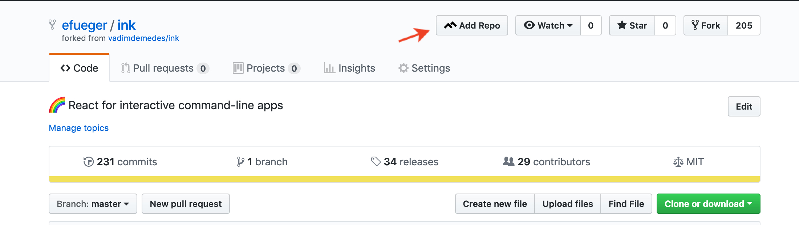

## Setting up your cloud environment

<!-- START doctoc generated TOC please keep comment here to allow auto update -->
<!-- DON'T EDIT THIS SECTION, INSTEAD RE-RUN doctoc TO UPDATE -->
**Table of Contents**  *generated with [DocToc](https://github.com/thlorenz/doctoc)*

- [AWS](#aws)
- [Github](#github)
- [TravisCI](#travisci)
  - [Configuration](#configuration)
- [Code Climate](#code-climate)
  - [Configuring Travis for Code Coverage](#configuring-travis-for-code-coverage)

<!-- END doctoc generated TOC please keep comment here to allow auto update -->

### AWS

You will need an [AWS](https://aws.amazon.com/account/) account.  You can get
free credits by activating your [GitHub Student Developer
Pack](https://education.github.com/pack).  Costs should be minimal, but be
responsible with any compute and storage you consume during the class.

### Github

If you have cloned this repo, congratulations, you already have this!

GitHub ***is not where you should edit work directly***.  You must develop
locally.  We know when you commit directly online!

### TravisCI

You can log into Travis with your github account.  You may want to use the
[Travis CLI](https://github.com/travis-ci/travis.rb).

#### Configuration

You may need to provide ***environment variables***, such as credentials or API
tokens, to the Travis run time environment.  These should never be committed to
your code base.  They may be manually added to [your Travis repo
settings](https://docs.travis-ci.com/user/environment-variables/#defining-variables-in-repository-settings)
or encrypted in your Travis yml.

### Code Climate

Log in to Code Climate with your GitHub account, then [join our
org](https://codeclimate.com/activate/f246e982a421a1aacea0b0a259afd5).

Go ahead and click 14 day free trial if needed (our org is free for students).

You will need to ***add every pset repository*** to Code Climate after you clone
it.

Once you're part of our Code Climate organization, you can:

1. Add repos with the Code Climate [Add a
Repo](https://codeclimate.com/accounts/5d43a020a5330100f30009cf/add_vcs_repo/new)
option:

2. OR use the [browser extension](https://codeclimate.com/browser-extension/)
`Add repo` button in GitHub:

#### Configuring Travis for Code Coverage
Once your repo is added to Code Climate, you will need to [get your token](https://docs.codeclimate.com/docs/finding-your-test-coverage-token) and add that to your
Travis build environment as `CC_TEST_REPORTER_ID`

